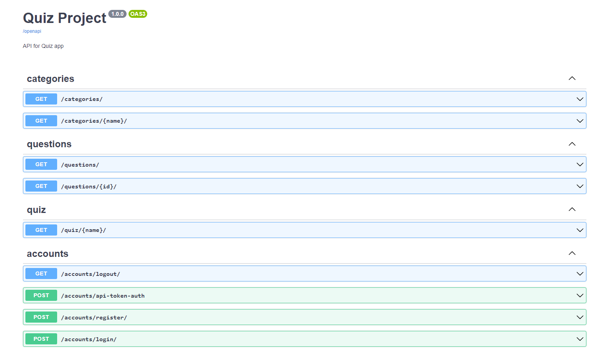

# QUIZAPP RESTAPI

### O projekcie:
> Aplikacja stworzona w django restapi do sprawdzania swojej wiedzy w quizach z języków
programowania, umożliwia propowanie nowych pytań przez użytkowników do istniejących już quizów,
zweryfikowane przez administatora sugestie mogą zostać dodane do określonego quizu,
jeśli pytanie nie spełnia kryteriów poprawności może zostać odrzucone.
Rozwiązywać quizy można anonimowo, jeśli chcemy zasugerować nowe pytanie do quizy należy
się zarejestrować. \
Aplikacja ma testy jednostkowe do pytań, kategorii rejestracji użytkowników.

*Podgląd aplikacji: **[LINK](https://quiz-app-restapi.herokuapp.com/)***

### Użyte technologie:
- django
- djangorestframework

### Instalacja:
...